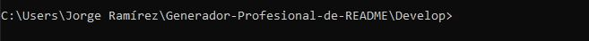
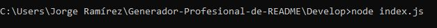
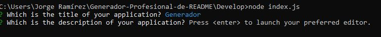
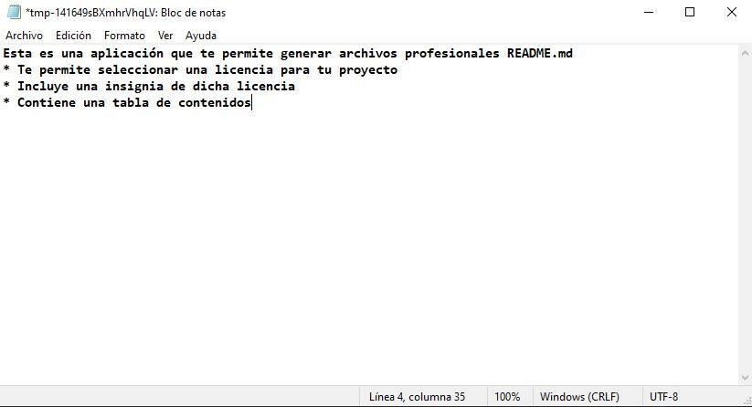
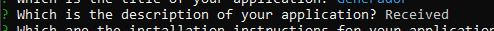
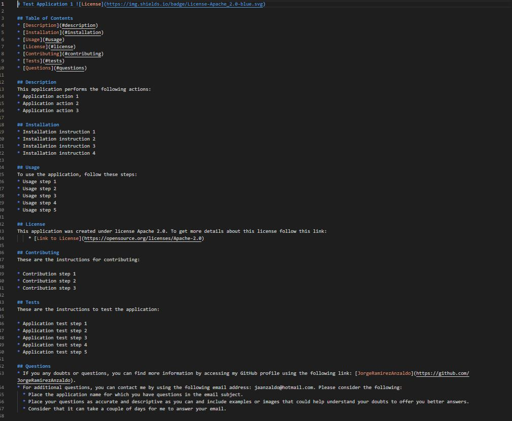

# Generador de archivo README.md profesional    

## Descripción de la aplicación  

* Esta aplicación permite la generación dinámica de un archivo README.md profesional.
* La información del archivo README.md es obtenida a partir del usuario por medio de la línea de comando y utilizando el paquete inquirer.
* Las secciones que se generan dinámicamente son:
    * Título de la aplicación: se introduce directamente en la línea de comando.
    * Tabla de contenido: lleva a la sección correspondiente del README.md
    * Descripción de la aplicación: la información se introduce por medio de un editor de texto.
    * Instrucciones de instalación: la información se introduce por medio de un editor de texto.
    * Información de uso: la información se introduce por medio de un editor de texto.
    * Instrucciones de contribución: la información se introduce por medio de un editor de texto.
    * Instrucciones para realizar pruebas: la información se introduce por medio de un editor de texto.
    * Licencia: la licencia a colocar en esta sección se selecciona de una lista desplegada en la línea de comando.
    * Preguntas: incluye el usuario de GitHub y correo electrónico, que se se introducen directamente en la línea de comando.
* A partir de la licencia seleccionada por el usuario:
    * Se coloca una insignia para dicha licencia a lado del título de la aplicación.
    * Se agrega un texto en la sección de Licencia y se coloca un link para obtener mayor información acerca de la licencia.
    * Si el usuario elige la opción de licencia vacía, entonces no se coloca la insignia, ni el texto en la sección de licencia.
* A partir del usuario de GitHub y el correo electrónico:
    * Se genera la sección de Preguntas con un enlace al perfil de GitHub del ususario e instrucciones para ponerse en contacto con el mismo.

## Instrucciones de instalación  

* Esta aplicación requiere de:
    * Instalación de node JS versión 16.18.0
    * Instalación del paquete npm inquirer versión 6.5.2
* Además, esta aplicación emplea el módulo fs para la creación del archivo.

## Instrucciones para realizar pruebas  

* Para ejecutar la aplicación se tiene que hacer desde la terminal de node.js
* Asegúrate de estar en la siguiente ubicación: GENERADOR-PROFESIONAL-DE-README\Develop\
  
* Ejecuta el comando: node index.js
  

## Información de uso de la aplicación  

* Cada vez que se te presente una pregunta, introduce la información en la línea de comando y presiona ENTER
* Para las secciones que se llenan utilizando el editor de texto:
    * Presiona ENTER en la línea de comando para abrir el editor de texto tal como lo indica la terminal.
    

    * Escribe tu texto tal como quieres que se despliegue en la sección correspondiente del README.md. Puedes colocar saltos de línea y * para crear bullets en el README.md.
    

    * Guarda el archivo, no tienes que cambiar el nombre predeterminado del archivo.
    * Cierra el editor de texto.
    * Después de estos pasos, deberás ver el mensaje "Received" en la línea de comando que llenaste.
    

* Una vez que hayas llenado toda la información:
    * Aparecerá el mensaje "File successfully created" en la terminal
    * El archivo README.md aparecerá en el mismo path GENERADOR-PROFESIONAL-DE-README\Develop\ con el nombre README.md.

## Enlace a video de funcionalidad de la aplicación

* [Link a video](https://drive.google.com/file/d/11QMevGjOxK2MJMAgGBy-Mme9WgeA3zKA/view)

## Muestra de un archivo README.md generado dinámicamente

